# PHASE 1 - WEEK 4 - FINAL PROJECT

# Cornucopia

A food recipe website, browse or search for recipes for any meal

The website can:
- List meal categories
- Explore meal category
- Search meal by category, search for ingredients
- Search for:
    -  meal by by full name
    -  meal by partial name
    - ingredients
- Show recipe details
- Show a random recipe

# Setup Requirements

- Visual Studio Code, see [here](https://code.visualstudio.com/)
- Windows Subsystem for Linux (WSL), details [here](https://learn.microsoft.com/en-us/windows/wsl/install)
- Git
- Github and GitHub pages [deployment](https://eugenemrg.github.io/Cornucopia/)
- Any Modern Web Browser

# Installation

- Clone/Download the code from the repository and run it on any modern web browser with JavaScript enabled

# Technologies

Technologies used in the project include:

- JavaScript
- HTML
- CSS
- JSON
- Public API [The Meal DB](https://www.themealdb.com/)

# Deployment Link

Visit [Cornucopia](https://eugenemrg.github.io/Cornucopia/)

# Screenshots

Landing page
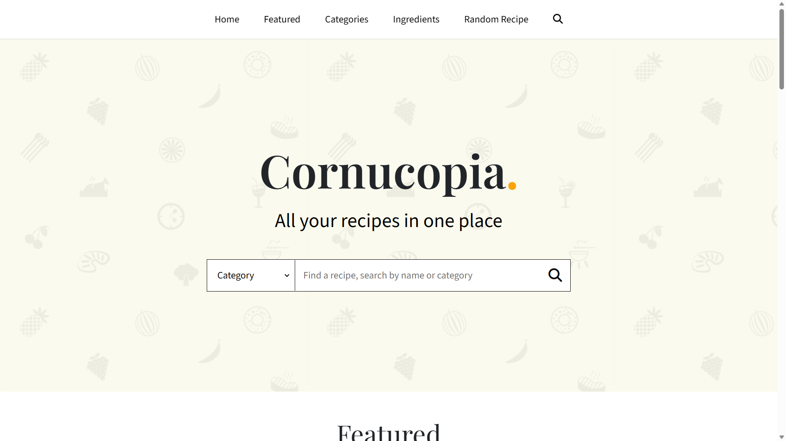

List all meal categories

Explore meal category
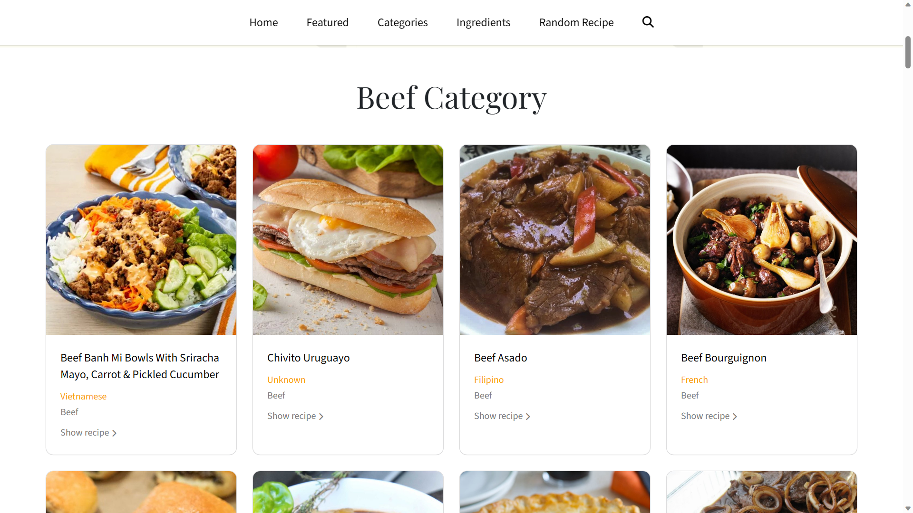

Search for meal by full or partial name
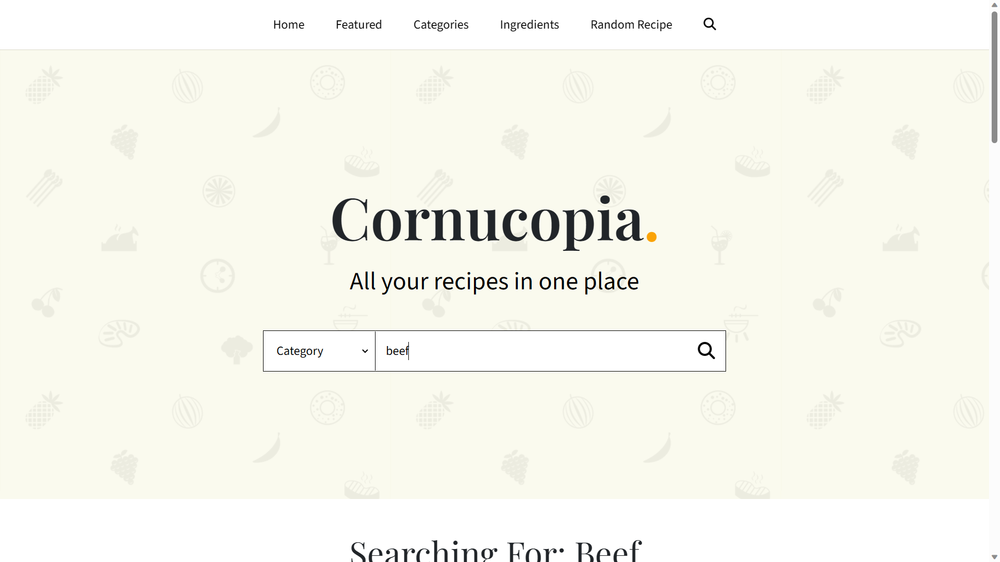

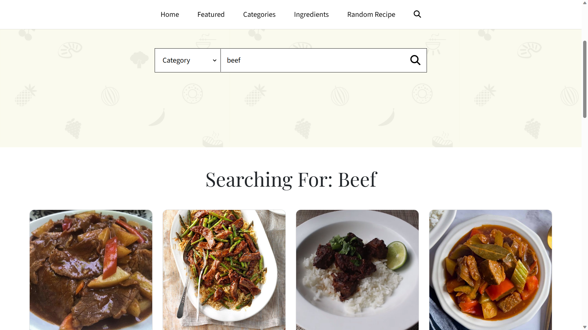

Search for meal by category
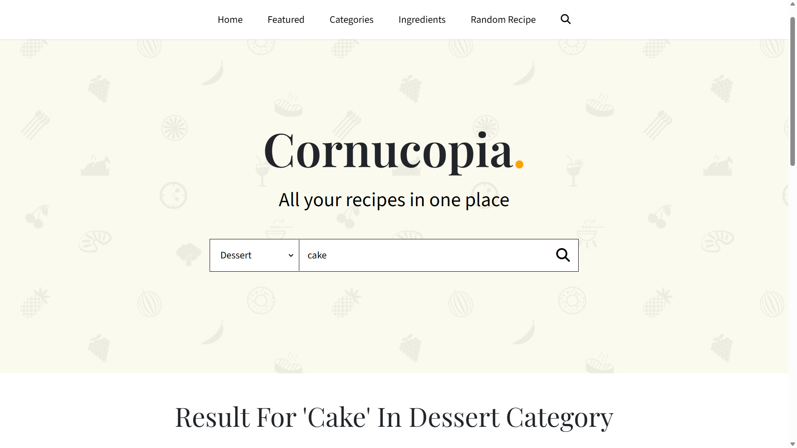

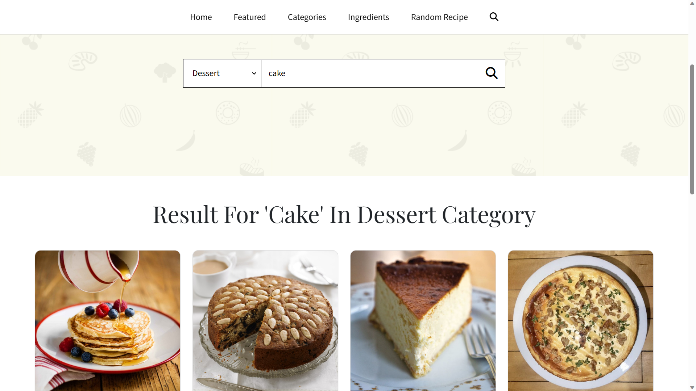

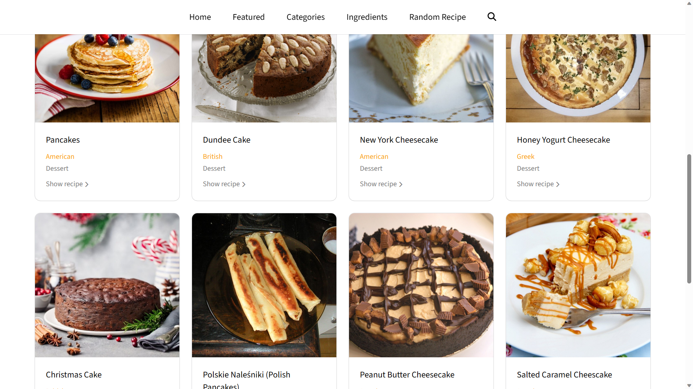

Search for ingredients
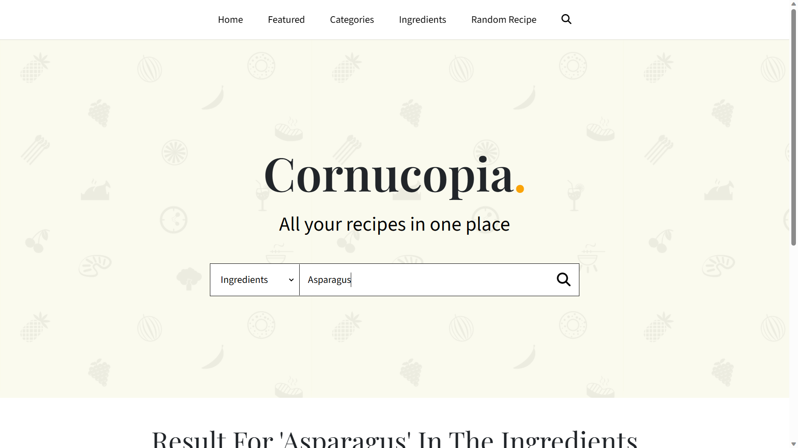

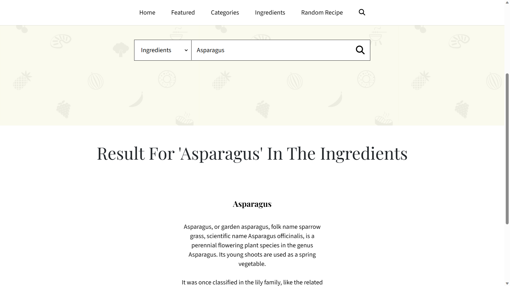

Show recipe details
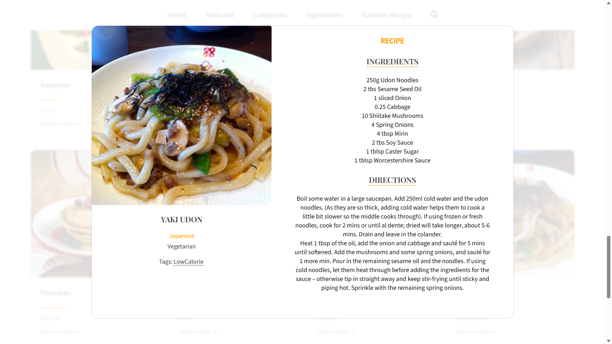

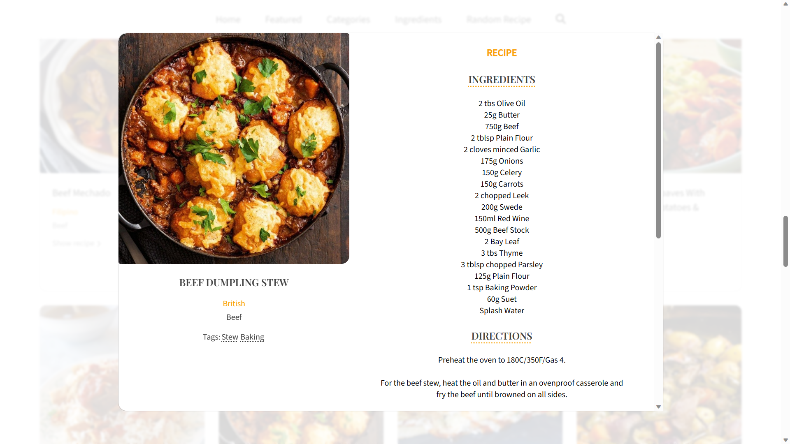

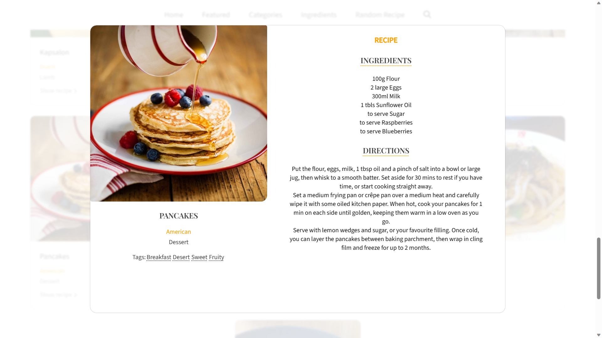

Show random meal and recipe
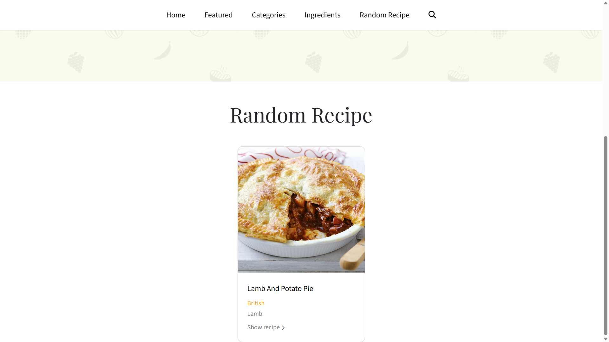

# Author

[Eugene Aduogo](https://github.com/eugenemrg)

# License

Cornucopia. A food recipe website, browse or search for recipes for any meal
Copyright (C) 2023  [Eugene Aduogo](https://github.com/eugenemrg)

Licensed under GNUv3. See [license](/LICENSE)

This program is free software: you can redistribute it and/or modify
it under the terms of the GNU General Public License as published by
the Free Software Foundation, either version 3 of the License, or
(at your option) any later version.

This program is distributed in the hope that it will be useful,
but WITHOUT ANY WARRANTY; without even the implied warranty of
MERCHANTABILITY or FITNESS FOR A PARTICULAR PURPOSE.  See the
GNU General Public License for more details.

You should have received a copy of the GNU General Public License
along with this program.  If not, see <https://www.gnu.org/licenses/>.